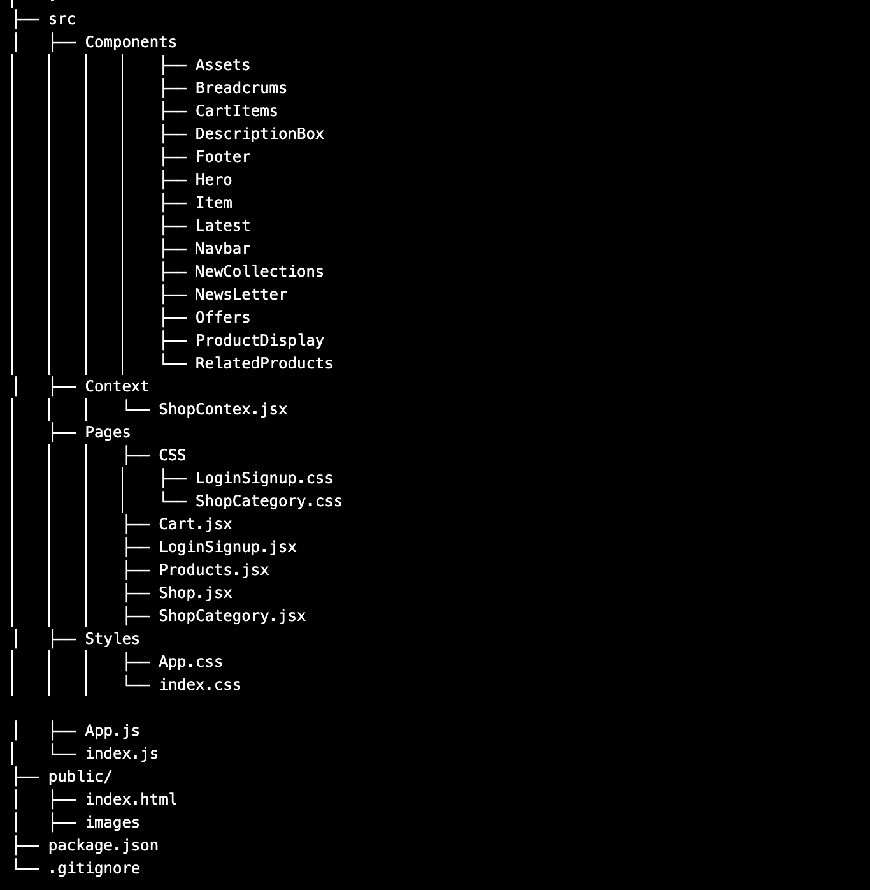

## Introduction
    #introduction: Welcome to Moshop - Your Ultimate Destination for Fashion

    At Moshop, we redefine online shopping, offering a curated collection of the latest trends in men's, women's, and kids' garments.
    We pride ourselves on being your go-to destination for stylish and affordable fashion.

## Features
    #features Seamless Cart Management: 

    - **Add to Cart:** Easily add items to your cart with just a click. Watch your selection come to life in your virtual shopping bag.

    - **View Cart:** Keep track of your chosen items. View your cart at any time to see the selected products, quantities, and individual prices.

    - **Subtotal & Total:** Experience transparency in pricing. See the subtotal for each item as well as the total cost of your entire cart before      proceeding to checkout.

    - **Remove from Cart:** Changed your mind? No worries. Remove items from your cart with a simple click. Your shopping experience, your rules.

## Categories
    #Categories We Offer:

   - **Men's Fashion:** Elevate your style with our collection of men's apparel, including trendy shirts, comfortable loungewear, and sophisticated accessories.

    - **Women's Fashion:** Embrace your individuality with our diverse range of women's clothing, from chic dresses to casual tops and accessories that
    make a statement.

   - **Kids' Corner:** Dress your little ones in style with our adorable and comfortable kids' garments. From playful prints to charming ensembles, we 
   have it   all.

## Technologies Used
        
    **List the technologies, frameworks, and tools I used to build my e-commerce website.**

    - **ReactJS - Building Dynamic User Interfaces:**

    Dynamic UIs: ReactJS, a JavaScript library, is at the core of Moshop. It enables us to create dynamic and responsive user interfaces, ensuring a smooth and engaging shopping experience.

    Component-Based Architecture: Our frontend is built on a modular, component-based architecture, allowing for scalable and maintainable code.

    - **HTML & CSS - Crafting Elegant Web Pages:**

    Structural Integrity: HTML (HyperText Markup Language) forms the structural foundation of our web pages, ensuring proper document structure and semantics.

    Styling Excellence: CSS (Cascading Style Sheets) is employed for styling, making sure that each element is aesthetically pleasing and aligned with the Moshop brand.

    - **JavaScript - Enhancing Interactivity:**

    Client-Side Functionality: JavaScript enhances the interactivity of Moshop's website, enabling dynamic content updates, form validation, and a seamless user experience.

    AJAX for Asynchronous Requests: We utilize JavaScript's AJAX capabilities to make asynchronous requests, ensuring quick and efficient data retrieval.

    - **Git & GitHub - Version Control for Collaboration:**

    Version Control: Git provides a robust version control system, allowing our development team to collaborate seamlessly. It tracks changes, facilitates branching, and ensures a stable and organized codebase.

    Collaboration Platform: GitHub serves as our collaborative platform, enabling developers to contribute, review code, and manage project workflows efficiently.

## [Project-structure] (#project-structure)
    .
├── src
│   ├── Components
                ├── Assets
                ├── Breadcrums
                ├── CartItems
                ├── DescriptionBox
                ├── Footer
                ├── Hero
                ├── Item
                ├── Latest
                ├── Navbar
                ├── NewCollections
                ├── NewsLetter
                ├── Offers
                ├── ProductDisplay
                └── RelatedProducts
│   ├── Context
            └── ShopContex.jsx
    ├── Pages
            ├── CSS 
                ├── LoginSignup.css
                └── ShopCategory.css
            ├── Cart.jsx
            ├── LoginSignup.jsx
            ├── Products.jsx
            ├── Shop.jsx
            ├── ShopCategory.jsx
│   ├── Styles
            ├── App.css
            └── index.css

│   ├── App.js
    └── index.js
├── public/
│   ├── index.html
│   ├── images
├── package.json
└── .gitignore



## contributing
    Md Khalid Mojib (My Self)

## [Acknowledgments] (#acknowledgments)

  **We would like to express our gratitude to the following individuals and projects that have contributed to the success of this e-commerce website:**

- **[Name](https://github.com/mk-mojib):** A special thank you to Md Khalid Mojib for their invaluable contributions.

- **[Project Name](https://github.com/ecommerce-react-app):** We utilized ecommerce-react-app


- **[Library/Tool](https://github.com/git):** We leveraged git for     Version Control: Git provides a robust version control system,
 allowing our development team to collaborate seamlessly. It tracks changes, facilitates branching, and ensures a stable and organized codebase..

These acknowledgments are a testament to the collaborative spirit and open-source community that made this project possible.

## [Contact](#contact)

    Feel free to reach out for questions, feedback, or collaboration opportunities.

    Email: mdkhalidmojib@gmail.com
    LinkedIn: https://www.linkedin.com/in/mdkhalidmojib/

## [Demo] (#demo)

Check out our live demo [here](https://mk-mojib.github.io/)


## Installation

Get started by installing the project locally. Provide step-by-step instructions and mention any prerequisites.

```bash
# Clone the repository
git clone https://github.com/mk-mojib/ecommerce-react-app.git

# Navigate to the project folder
cd ecommerce-react-app

# Install dependencies
npm install

# Run the development server
npm start
